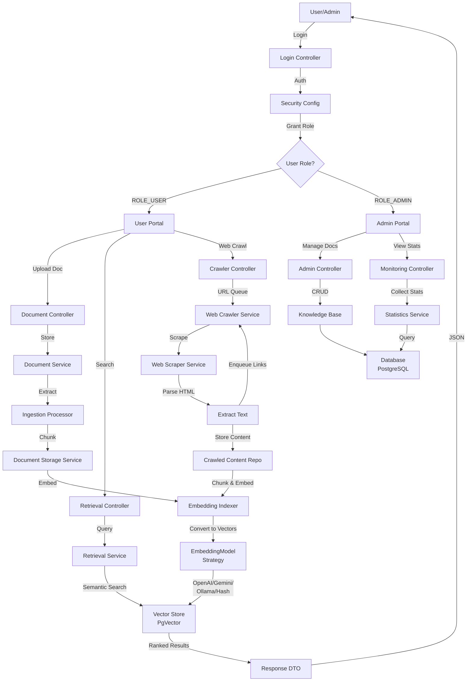
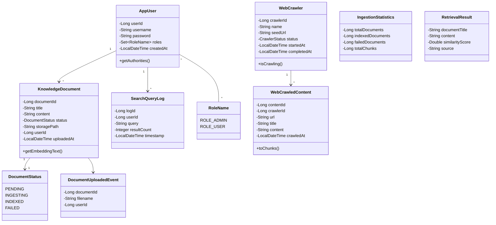
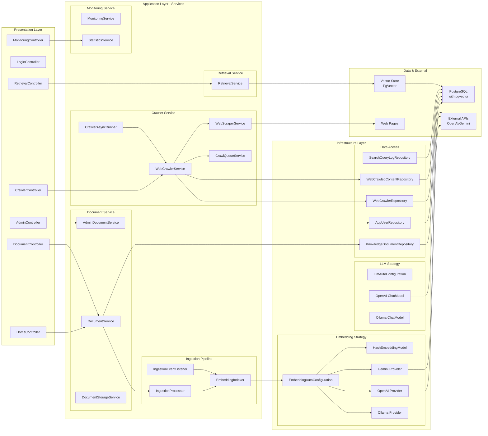
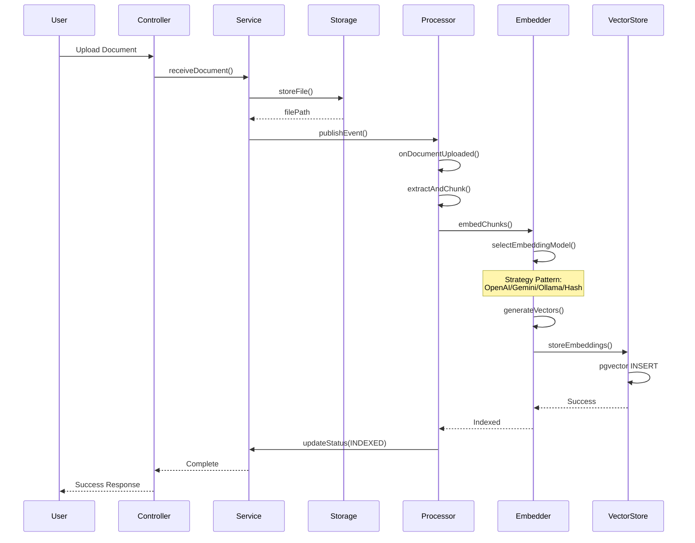
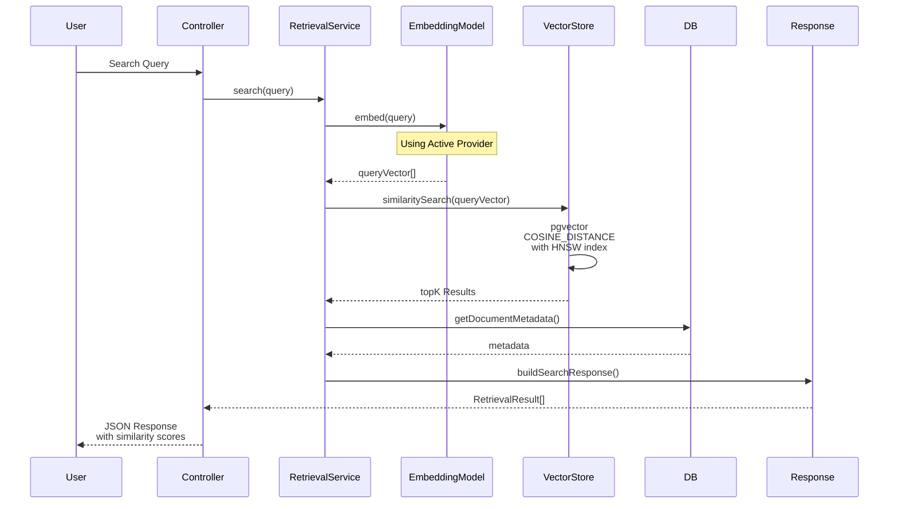
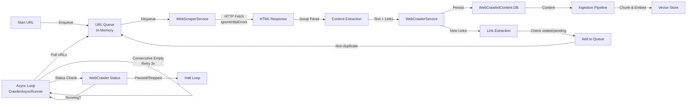
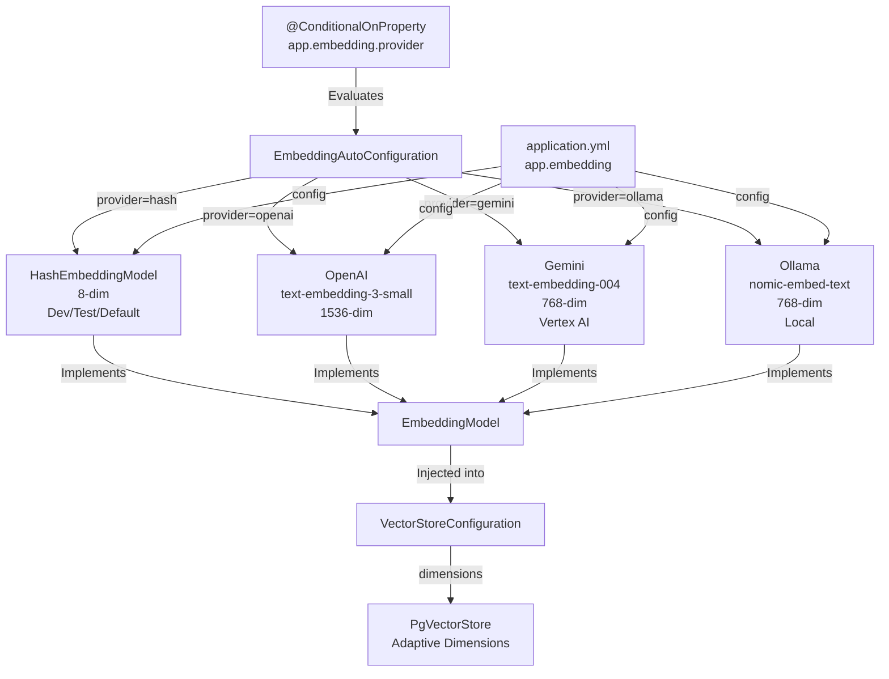
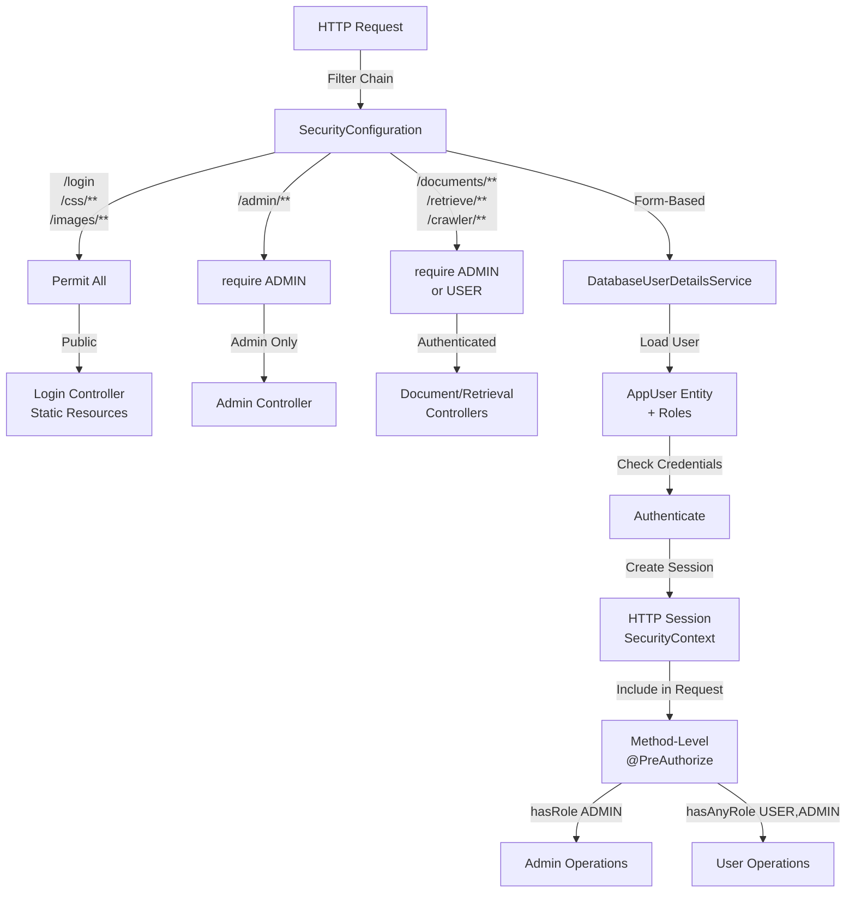

# RAG-MVP2 Architecture Diagrams

## System Flow Diagram



## Class Diagram - Domain Model



## Component Architecture Diagram



## RBAC (Role-Based Access Control) Diagram

```mermaid
graph TD
    A["User"] -->|Login| B["Authentication<br/>Form-Based"]
    B -->|Verified| C{Authorization}
    
    C -->|ROLE_ADMIN| D["Admin Access"]
    C -->|ROLE_USER| E["User Access"]
    C -->|No Role| F["Public Access<br/>Login/Error/Static"]
    
    D -->|/admin/**| D1["Admin Dashboard"]
    D -->|@PreAuthorize<br/>hasRole ADMIN| D2["Manage Users"]
    D -->|@PreAuthorize<br/>hasRole ADMIN| D3["View Statistics"]
    D -->|@PreAuthorize<br/>hasRole ADMIN| D4["Delete Documents"]
    D -->|@PreAuthorize<br/>hasRole ADMIN| D5["System Monitoring"]
    
    D1 --> D2
    D1 --> D3
    D1 --> D4
    D1 --> D5
    
    E -->|/home| E1["Home Page"]
    E -->|/documents/**| E2["Document Mgmt"]
    E -->|/retrieve/search| E3["Search & Retrieve"]
    E -->|/crawler/**| E4["Web Crawler Control"]
    
    E2 -->|@PreAuthorize<br/>hasAnyRole USER ADMIN| E2A["Upload Document"]
    E2 -->|@PreAuthorize<br/>hasAnyRole USER ADMIN| E2B["View My Documents"]
    E2 -->|@PreAuthorize<br/>hasAnyRole USER ADMIN| E2C["Ingest Document"]
    
    E3 -->|@PreAuthorize<br/>hasAnyRole USER ADMIN| E3A["Semantic Search"]
    E3 -->|@PreAuthorize<br/>hasAnyRole USER ADMIN| E3B["Log Query"]
    
    E4 -->|@PreAuthorize<br/>hasAnyRole USER ADMIN| E4A["Start Crawler"]
    E4 -->|@PreAuthorize<br/>hasAnyRole USER ADMIN| E4B["View Crawler Status"]
    E4 -->|@PreAuthorize<br/>hasAnyRole USER ADMIN| E4C["Pause/Resume/Stop"]
    
    F -->|/login| F1["Login Page"]
    F -->|/css/**,/images/**| F2["Static Resources"]
    F -->|/error| F3["Error Page"]
```

## Data Flow - Document Ingestion Pipeline



## Data Flow - Retrieval/Search Pipeline



## Web Crawler Pipeline



## Embedding Provider Strategy Pattern



## Security Architecture


